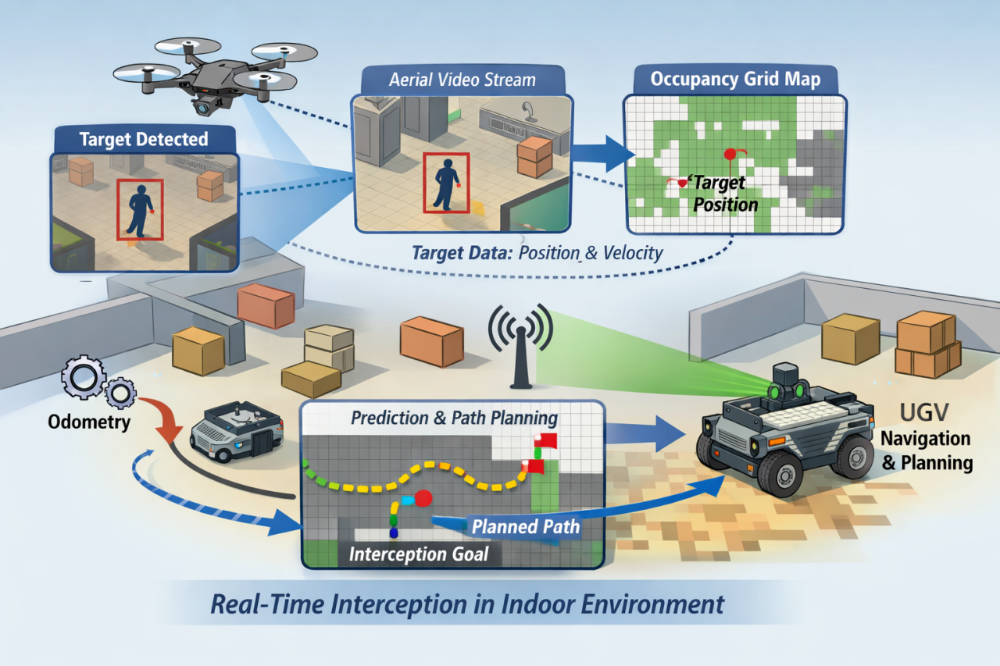
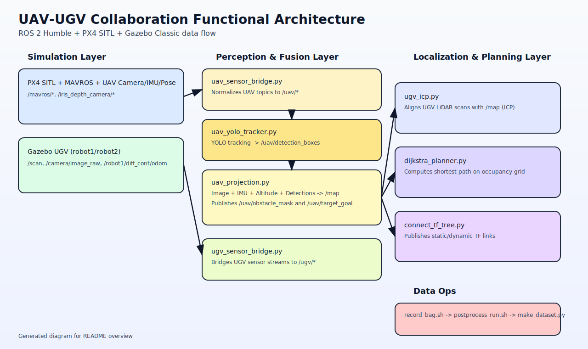

# UAV-UGV Collaboration (ROS 2 + PX4 + Gazebo Classic)

Multi-robot simulation workspace for UAV/UGV collaboration in ROS 2 Humble, combining:
- PX4 SITL + MAVROS (UAV side)
- Gazebo Classic simulation
- UGV perception/localization/planning
- UAV perception and projection pipeline (YOLO + occupancy map generation)

## Functional Description

This repository implements an end-to-end cooperative autonomy loop:

1. UAV sensors (camera, IMU, altitude, pose) are bridged from PX4/MAVROS into standardized `/uav/*` topics.
2. YOLO tracking runs on the UAV RGB stream and publishes 2D detections.
3. UAV projection converts image-space information into world-space occupancy data and publishes `/map`.
4. UGV sensor streams are normalized to `/ugv/*` topics.
5. UGV ICP aligns LiDAR scan points with the UAV-generated occupancy map for localization refinement.
6. Dijkstra planning computes shortest paths on the occupancy grid toward goal poses.
7. TF connector keeps the cross-platform frame tree coherent (`world`, `map`, drone and robot frames).
8. Bag recording and post-processing scripts support experiments and dataset generation.

## Project Idea Diagram



## Architecture Diagram



## Repository Layout

- `CMakeLists.txt`: ROS 2 package build/install config (`my_package`)
- `package.xml`: ROS 2 metadata (currently not fully aligned, see Notes)
- `launch/`: launch descriptions for robot state publisher and Gazebo spawning
- `urdf/robot1`, `urdf/robot2`: robot models and ros2_control setup
- `worlds/`: Gazebo world files
- `models/`: Gazebo model assets
- `config/`: controller YAML and YOLO weights (`best.pt`)
- `scripts/`: runtime nodes and data tooling
- `docs/project_idea.png`: concept figure of the UAV-UGV interception pipeline
- `docs/architecture.svg`: high-level functional architecture image
- `Dockerfile`, `docker-compose.yml`, `entrypoint.sh`: containerized PX4 + ROS 2 environment

## Main Runtime Components

- `scripts/uav_sensor_bridge.py`
  - Input: `/iris_depth_camera/rgb_camera/image_raw`, `/mavros/imu/data`, `/mavros/local_position/odom`, `/mavros/local_position/pose`
  - Output: `/uav/camera/image_raw`, `/uav/imu`, `/uav/odom`, `/uav/altitude`

- `scripts/uav_yolo_tracker.py`
  - Input: `/uav/camera/image_raw`
  - Output: `/uav/detection_boxes` (`vision_msgs/Detection2DArray`)

- `scripts/uav_projection.py`
  - Input: `/uav/camera/image_raw`, `/uav/imu`, `/uav/altitude`, `/uav/detection_boxes`
  - Output: `/map`, `/uav/obstacle_mask`, `/uav/target_goal`

- `scripts/ugv_sensor_bridge.py`
  - Input: `/camera/image_raw`, `/imu`, `/robot1/diff_cont/odom`, `/scan`
  - Output: `/ugv/camera/image_raw`, `/ugv/imu`, `/ugv/odom`, `/ugv/scan`

- `scripts/ugv_icp.py`
  - Input: `/ugv/scan`, `/ugv/odom`, `/map`
  - Output: `/ugv/icp/pose`, `/ugv/icp/transform`

- `scripts/dijkstra_planner.py`
  - Input: `/map`, `/goal_pose` (+ TF lookup)
  - Output: `/dijkstra/path`, `/dijkstra/visited_map`

- `scripts/connect_tf_tree.py`
  - Input: `/mavros/local_position/pose`, `/robot1/diff_cont/odom`, `/robot2/diff_cont/odom`
  - Output: static and dynamic TF transforms

## Prerequisites (Local, Non-Docker)

- Ubuntu + ROS 2 Humble
- Gazebo Classic 11 + `gazebo_ros` integration
- PX4 SITL (if running UAV stack)
- MAVROS + GeographicLib datasets
- Python dependencies used by scripts:
  - `numpy`, `scipy`, `opencv-python`, `cv_bridge`, `ultralytics`

## Quick Start (Recommended: Docker)

From repo root (`/home/yassine/ros/UAV_UGV_Collaboration`):

```bash
docker compose build
docker compose up -d
docker exec -it px4_ros2 bash
```

Inside the container, the entrypoint configures ROS/Gazebo paths and builds the workspace in dev mode.

### Optional autostart flags
Set in `docker-compose.yml` environment:
- `AUTOSTART_PX4=1`: start PX4 SITL + Gazebo Classic automatically
- `AUTOSTART_ROS2=1`: run `ros2 launch <pkg> <file>` automatically
- `AUTOSTART_MAVROS=1`: start MAVROS automatically
- `HEADLESS=1`: run Gazebo without client (recommended on WSLg)

## Build and Source (Local)

If running directly on host:

```bash
cd /home/yassine/ros
source /opt/ros/humble/setup.bash
colcon build --symlink-install
source install/setup.bash
```

## Launching the Robots

`launch/launch.py` publishes robot description for a selected robot namespace:

```bash
ros2 launch my_package launch.py robot_name:=robot1
```

`launch/launch_sim.py` includes the previous launch and spawns the robot in Gazebo:

```bash
ros2 launch my_package launch_sim.py robot_name:=robot1
ros2 launch my_package launch_sim.py robot_name:=robot2
```

## Running the Python Nodes

Most scripts are plain Python ROS 2 nodes in `scripts/`.
Run them after sourcing your workspace:

```bash
python3 /root/dev_ws/src/my_package/scripts/uav_sensor_bridge.py
python3 /root/dev_ws/src/my_package/scripts/uav_yolo_tracker.py
python3 /root/dev_ws/src/my_package/scripts/uav_projection.py
python3 /root/dev_ws/src/my_package/scripts/ugv_sensor_bridge.py
python3 /root/dev_ws/src/my_package/scripts/ugv_icp.py
python3 /root/dev_ws/src/my_package/scripts/dijkstra_planner.py
python3 /root/dev_ws/src/my_package/scripts/connect_tf_tree.py
```
