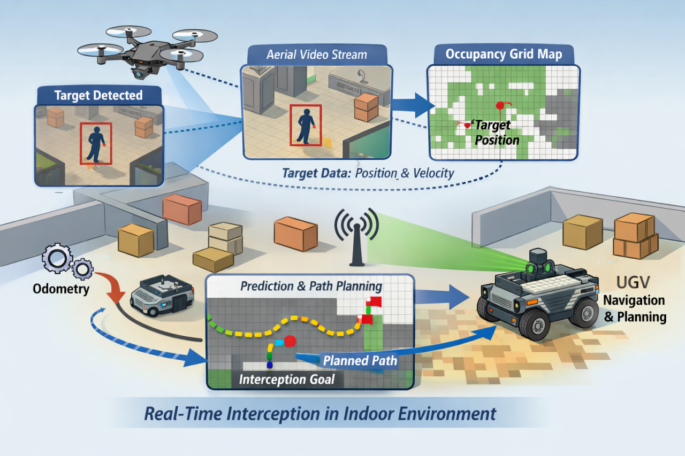
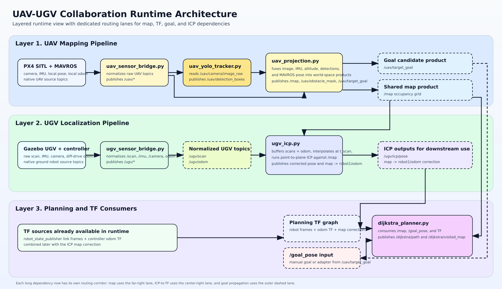
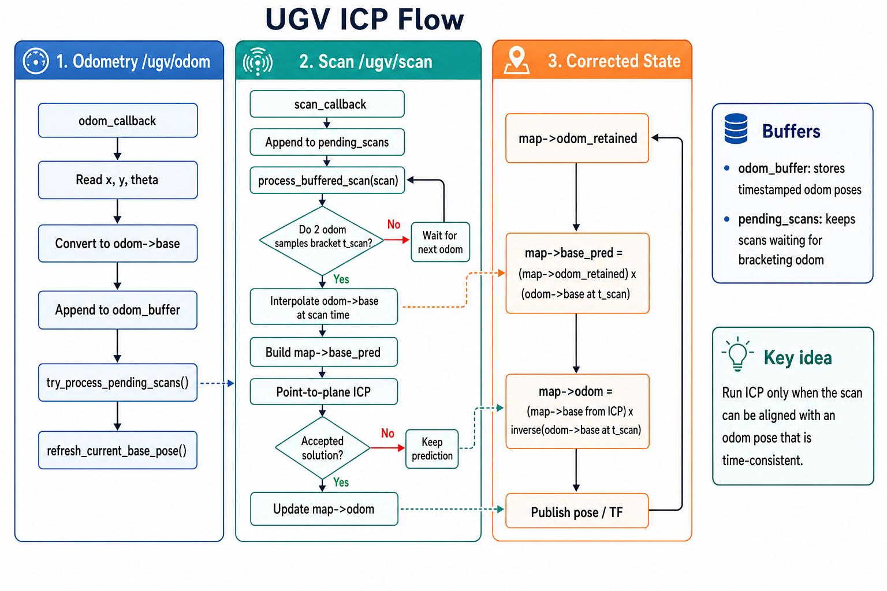

# UAV-UGV Collaboration (ROS 2 + PX4 + Gazebo Classic)

Multi-robot simulation workspace for UAV/UGV collaboration in ROS 2 Humble, combining:
- PX4 SITL + MAVROS (UAV side)
- Gazebo Classic simulation
- UGV perception/localization/planning
- UAV perception and projection pipeline (YOLO + occupancy map generation)

## Functional Description

This repository implements an end-to-end cooperative autonomy loop:

1. UAV sensors (camera, IMU, altitude, pose) are bridged from PX4/MAVROS into standardized `/uav/*` topics.
2. YOLO tracking runs on the UAV RGB stream and publishes 2D detections.
3. UAV projection converts image-space information into world-space occupancy data and publishes `/map`.
4. UGV sensor streams are normalized to `/ugv/*` topics.
5. UGV ICP aligns LiDAR scan points with the UAV-generated occupancy map for localization refinement.
6. Dijkstra planning computes shortest paths on the occupancy grid toward goal poses.
7. The planner-visible TF chain is assembled from `robot_state_publisher`, controller odometry, and the `map -> robot1/odom` correction broadcast by `ugv_icp.py`.
8. Launch files, container tooling, and docs support repeatable simulation experiments.

## Project Idea Diagram



## Architecture Diagram



The diagram groups the system into platform sources, bridge/perception nodes, shared state, and localization/planning consumers so the ownership of each topic and TF edge is visible at a glance.

## UGV ICP Workflow



The current `scripts/ugv_icp.py` workflow is time-consistent rather than "use the latest odom and hope it matches":

1. `odom_callback` stores timestamped odom poses in `odom_buffer`.
2. `scan_callback` queues incoming scans in `pending_scans`.
3. A scan is processed only once two odom samples bracket `t_scan`.
4. `ugv_icp.py` interpolates `odom -> base` at the scan timestamp, builds `map -> base_pred`, and runs point-to-plane ICP against `/map`.
5. If the ICP solution is accepted, the node updates the retained `map -> odom` correction and republishes the corrected pose / TF.

## Repository Layout

- `CMakeLists.txt`: ROS 2 package build/install config (`my_package`)
- `package.xml`: ROS 2 metadata (currently not fully aligned, see Notes)
- `launch/`: launch descriptions for robot state publisher and Gazebo spawning
- `urdf/robot1`, `urdf/robot2`: robot models and ros2_control setup
- `worlds/`: Gazebo world files
- `models/`: Gazebo model assets
- `config/`: controller YAML and YOLO weights (`best.pt`)
- `scripts/`: runtime nodes and data tooling
- `docs/project_idea.png`: concept figure of the UAV-UGV interception pipeline
- `docs/architecture.svg`: high-level functional architecture image
- `docs/ugv_icp_workflow_en.png`: English diagram of the buffered/interpolated UGV ICP pipeline
- `Dockerfile`, `docker-compose.yml`, `entrypoint.sh`: containerized PX4 + ROS 2 environment

## Main Runtime Components

- `scripts/uav_sensor_bridge.py`
  - Input: `/iris_depth_camera/rgb_camera/image_raw`, `/mavros/imu/data`, `/mavros/local_position/odom`, `/mavros/local_position/pose`
  - Output: `/uav/camera/image_raw`, `/uav/imu`, `/uav/odom`, `/uav/altitude`

- `scripts/uav_yolo_tracker.py`
  - Input: `/uav/camera/image_raw`
  - Output: `/uav/detection_boxes` (`vision_msgs/Detection2DArray`)

- `scripts/uav_projection.py`
  - Input: `/uav/camera/image_raw`, `/uav/imu`, `/uav/altitude`, `/uav/detection_boxes`
  - Output: `/map`, `/uav/obstacle_mask`, `/uav/target_goal`

- `scripts/ugv_sensor_bridge.py`
  - Input: `/camera/image_raw`, `/imu`, `/robot1/diff_cont/odom`, `/scan`
  - Output: `/ugv/camera/image_raw`, `/ugv/imu`, `/ugv/odom`, `/ugv/scan`

- `scripts/ugv_icp.py`
  - Input: `/ugv/scan`, `/ugv/odom`, `/map`
  - Output: `/ugv/icp/pose`, `/ugv/icp/transform`, `/ugv/icp/target_normals`
  - Role: buffered point-to-plane ICP with scan deferral, odom interpolation at `t_scan`, and retained `map -> odom` correction

- `scripts/dijkstra_planner.py`
  - Input: `/map`, `/goal_pose` (+ TF lookup)
  - Output: `/dijkstra/path`, `/dijkstra/visited_map`

## TF and Goal Routing Notes

- There is no standalone `connect_tf_tree.py` in the current repository tree. The planner-facing TF graph is currently built from `robot_state_publisher`, Gazebo/controller odometry, and `scripts/ugv_icp.py` broadcasting `map -> robot1/odom`.
- `scripts/uav_projection.py` publishes candidate goals on `/uav/target_goal`, while `scripts/dijkstra_planner.py` subscribes to `/goal_pose`. A small adapter node or operator handoff is still needed to route the projected target directly into the planner.

## Prerequisites (Local, Non-Docker)

- Ubuntu + ROS 2 Humble
- Gazebo Classic 11 + `gazebo_ros` integration
- PX4 SITL (if running UAV stack)
- MAVROS + GeographicLib datasets
- Python dependencies used by scripts:
  - `numpy`, `scipy`, `opencv-python`, `cv_bridge`, `ultralytics`

## Quick Start (Recommended: Docker)

From repo root (`/home/yassine/ros/UAV_UGV_Collaboration`):

```bash
docker compose build
docker compose up -d
docker exec -it px4_ros2 bash
```

Inside the container, the entrypoint configures ROS/Gazebo paths and builds the workspace in dev mode.

### Optional autostart flags
Set in `docker-compose.yml` environment:
- `AUTOSTART_PX4=1`: start PX4 SITL + Gazebo Classic automatically
- `AUTOSTART_ROS2=1`: run `ros2 launch <pkg> <file>` automatically
- `AUTOSTART_MAVROS=1`: start MAVROS automatically
- `HEADLESS=1`: run Gazebo without client (recommended on WSLg)

## Build and Source (Local)

If running directly on host:

```bash
cd /home/yassine/ros
source /opt/ros/humble/setup.bash
colcon build --symlink-install
source install/setup.bash
```

## Launching the Robots

`launch/launch.py` publishes robot description for a selected robot namespace:

```bash
ros2 launch my_package launch.py robot_name:=robot1
```

`launch/launch_sim.py` includes the previous launch and spawns the robot in Gazebo:

```bash
ros2 launch my_package launch_sim.py robot_name:=robot1
ros2 launch my_package launch_sim.py robot_name:=robot2
```

## Manual Launch Procedure

The following sequence matches the current manual bring-up flow inside the dev container. Use separate terminals or tmux panes for the long-running processes.

### 1. Start MAVROS

```bash
ros2 run mavros mavros_node --ros-args \
  -p fcu_url:=udp://:14540@127.0.0.1:14557 \
  -p target_system_id:=1 \
  -p target_component_id:=1 \
  -p fcu_protocol:=v2.0 \
  -p use_sim_time:=true
```

### 2. Start PX4 SITL and Gazebo Classic

```bash
export LIBGL_ALWAYS_SOFTWARE=1
export MESA_GL_VERSION_OVERRIDE=4.5
source /usr/share/gazebo-11/setup.sh

cd /root/PX4-Autopilot
PX4_SITL_WORLD=/root/dev_ws/src/my_package/worlds/my_world make px4_sitl gazebo-classic_iris_depth_camera
```

### 3. Start the Gazebo client

```bash
gzclient --verbose
```

### 4. Spawn the UGVs and target

```bash
ros2 launch my_package launch_sim.py robot_name:=robot2
ros2 launch my_package launch_sim.py robot_name:=robot1
```

### 5. Launch the ROS 2 runtime nodes

```bash
python3 /root/dev_ws/src/my_package/scripts/uav_sensor_bridge.py --ros-args -p use_sim_time:=true
python3 /root/dev_ws/src/my_package/scripts/ugv_sensor_bridge.py --ros-args -p use_sim_time:=true
python3 /root/dev_ws/src/my_package/scripts/uav_yolo_tracker.py --ros-args -p use_sim_time:=true
python3 /root/dev_ws/src/my_package/scripts/uav_projection.py --ros-args -p use_sim_time:=true
python3 /root/dev_ws/src/my_package/scripts/ugv_icp.py --ros-args -p use_sim_time:=true
python3 /root/dev_ws/src/my_package/scripts/ekf_fusion.py --ros-args -p use_sim_time:=true
```

### 6. Start RViz

```bash
rviz2 --ros-args -p use_sim_time:=true
```

### 7. Move the robot

```bash
ros2 run teleop_twist_keyboard teleop_twist_keyboard --ros-args -r /cmd_vel:=/robot1/diff_cont/cmd_vel_unstamped
```

## Running the Python Nodes

Most scripts are plain Python ROS 2 nodes in `scripts/`.
Run them after sourcing your workspace:

```bash
python3 /root/dev_ws/src/my_package/scripts/uav_sensor_bridge.py
python3 /root/dev_ws/src/my_package/scripts/uav_yolo_tracker.py
python3 /root/dev_ws/src/my_package/scripts/uav_projection.py
python3 /root/dev_ws/src/my_package/scripts/ugv_sensor_bridge.py
python3 /root/dev_ws/src/my_package/scripts/ugv_icp.py
python3 /root/dev_ws/src/my_package/scripts/dijkstra_planner.py
```
